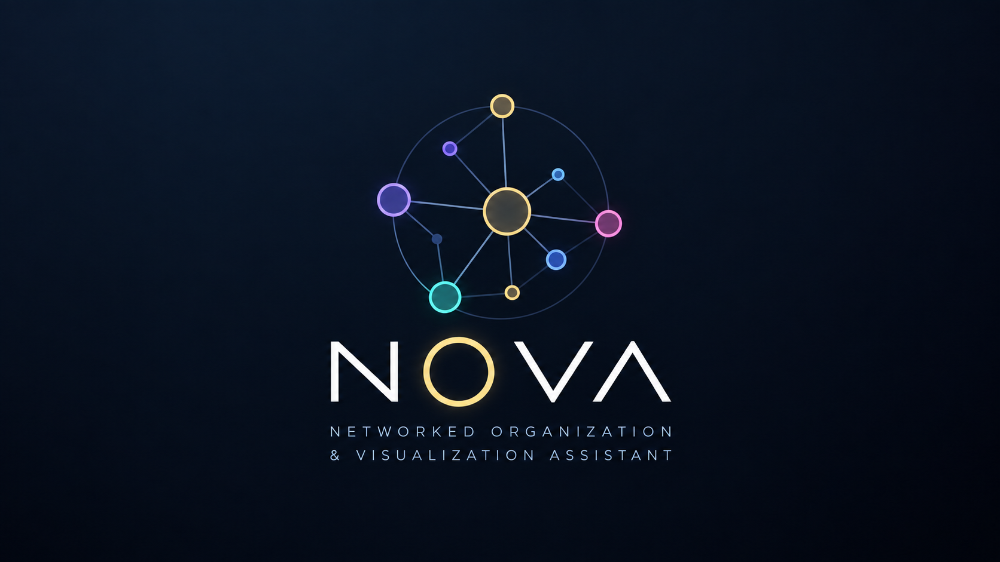
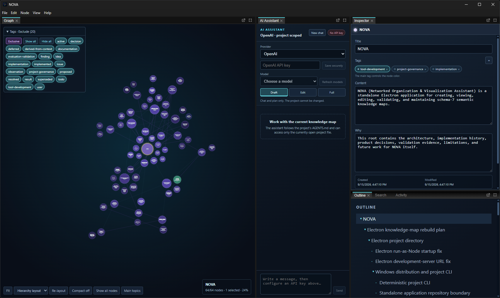
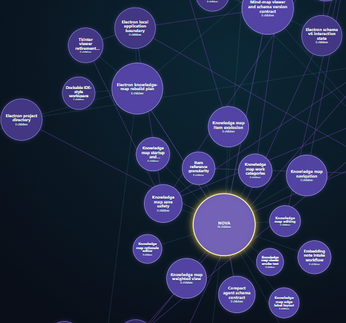
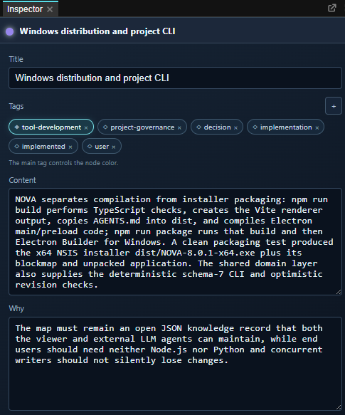
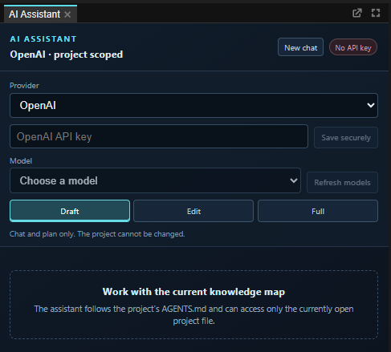
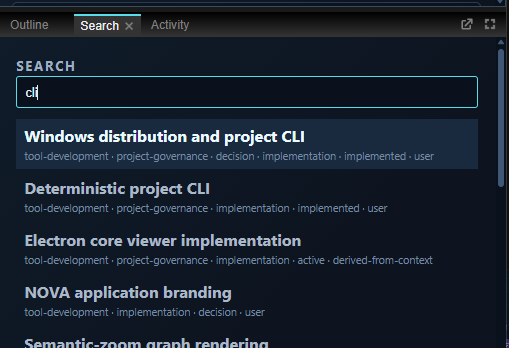

<div align="center">
  

  <h3>Your work does not happen in a list.<br>Why should its memory?</h3>

  <p>
    <strong>An automated, AI-assisted work, project, and research protocol.</strong><br>
    NOVA turns the meaningful parts of an evolving project into a living knowledge network.
  </p>

  <p>
    <code>Electron</code> · <code>React</code> · <code>TypeScript</code> · <code>Schema 7</code> · <code>Local JSON</code> · <code>Windows</code>
  </p>
</div>



---

## The anti-notebook

Most project notes become a graveyard of headings: long, linear, increasingly difficult to navigate, and detached from the decisions that created them.

NOVA keeps the *externalized thought process* instead—the questions, decisions, rationale, evidence, experiments, limitations, failures, implementation history, and open work that make a project understandable.

```text
chronological notes                   NOVA
──────────────────                    ────
what happened next?         →         what belongs together?
one document                →         nested concepts + semantic links
manual housekeeping         →         AI-assisted maintenance
search for a sentence       →         navigate the structure
remember the context        →         preserve the rationale
```

The result is not a prettier list. It is a categorized, searchable and filterable network graph. Related work gathers into visible neighborhoods. Important hubs grow. Cross-cutting relationships remain visible. Regions of interest begin to form almost by themselves.

<p align="center">
  
</p>

## A protocol that works while you work

NOVA is meant to answer questions ordinary notes cannot answer reliably:

- Why was this architecture or method selected?
- Which alternatives were considered or rejected?
- What evidence supports a finding?
- Which experiment addresses which research question?
- What failed, what superseded it, and what remains unresolved?
- What belongs in implementation, evaluation, discussion, or future work?

The included [`AGENTS.md`](AGENTS.md) gives an IDE-integrated AI agent a durable maintenance contract. While the agent helps with the actual work, it also decides whether the interaction produced meaningful project knowledge. If it did, the agent extends the smallest appropriate part of the map, preserves rationale and provenance, creates useful semantic links, and validates the result. If it did not, the map stays untouched.

That distinction matters: **automatic does not mean indiscriminate**. NOVA is designed to resist transcript dumping, duplicate notes, and ceremonial updates. It records the information needed to reconstruct the work—not every sentence spoken along the way.

## Two ways to use NOVA

### 01 — Standalone

Open a project, explore the graph, edit nodes, search, filter, rearrange the workspace, and use the built-in AI Assistant. OpenAI and FhGenie providers are supported directly in the application. (More will follow.)

API credentials remain outside the project file and renderer. They are **encrypted with Electron's OS-backed secure storage**. Draft, Edit, and Full modes make the assistant's project permissions explicit, giving you the veto right to every change before it is applied.

### 02 — Beside an AI-enabled IDE

This is where NOVA becomes a background memory system for serious work. Keep the project JSON beside the code, research, or documentation. The included agent instructions and deterministic CLI let an IDE agent maintain the map as part of normal work—without asking you to manually curate a second record afterward.

The application watches the open project file, so external agent updates appear in the workspace. The file remains ordinary, portable JSON rather than an opaque database.

## One workspace, several ways into the same knowledge

<table>
  <tr>
    <td width="33%" valign="top">
      
      <br><strong>Knowledge with reasons</strong><br>
      Nodes carry titles, tags, content, rationale, timestamps, children, and semantic links—not just loose text.
    </td>
    <td width="33%" valign="top">
      
      <br><strong>Project-scoped AI</strong><br>
      Work conversationally in Draft, Edit, or Full mode through narrow, validated project operations.
    </td>
    <td width="33%" valign="top">
      
      <br><strong>Find the concept</strong><br>
      Search titles, summaries, and tags; filter the graph inclusively or exclusively; navigate through the Outline.
    </td>
  </tr>
</table>

## What the graph knows

NOVA combines a strict hierarchy with free semantic relationships:

- **Nested nodes** express ownership and strong topic membership.
- **Links** express relationships such as `supports`, `depends-on`, `implements`, `supersedes`, `evaluates`, or `derived-from`.
- **Tags** describe epistemic role and work area: decision, hypothesis, method, result, limitation, implementation, documentation, and more.
- **A main tag** gives every node a stable color identity, while depth shading keeps hierarchy legible.
- **Semantic zoom** reveals the right amount of detail for the current scale.
- **Layout profiles** can emphasize hierarchy or relationships, with optional compact grouping.
- **Collapsed-link bubbling** keeps relationships visible even when their exact endpoints are hidden inside a branch.

The map stores its own view state—expanded branches, node positions, zoom, viewport, filters, and dock layout—so the working context travels with the knowledge.

## Built for durable project memory

| Concern | NOVA's approach |
|---|---|
| Open data | One human-readable JSON project file. |
| Safe writes | Schema validation, atomic replacement, and stale-revision detection. |
| Concurrent work | External-file watching and conflict-aware editor drafts. |
| Stable identity | Collision-checked UUIDs and protected project-root semantics. |
| Automation | A deterministic JSON-in/JSON-out CLI shared with the desktop domain layer. |
| Portability | Project knowledge and workspace state travel together; machine-local paths and credentials do not. |
| Focus | The maintenance contract records meaningful knowledge and rejects conversational bloat. |

## Get NOVA

NOVA currently targets Windows.

### Pre-built — Windows

Download the current x64 installer from **[GitHub Releases](https://github.com/GrafKnusprig/nova/releases/latest)** and run `NOVA-<version>-x64.exe`.

The installer contains the complete desktop application. Node.js, Python, and a separate backend are not required to use it. Bring an existing schema-7 project JSON or start a new knowledge map from the application.

### Self-built

Install the dependencies and start the development application:

```powershell
npm ci
npm run dev
```

Build the renderer and Electron main/preload processes:

```powershell
npm run build
```

Create the Windows x64 installer yourself:

```powershell
npm run package
```

The packaged installer is written to `dist/NOVA-<version>-x64.exe`.

## Let an agent maintain a project

Keep [`AGENTS.md`](AGENTS.md) next to the project file so a compatible IDE agent can discover the schema and maintenance policy. Every CLI command operates on the explicit path you provide—the project filename is yours to choose.

```powershell
NOVA-CLI.exe validate --project .\my-research-project.json
NOVA-CLI.exe list --project .\my-research-project.json
NOVA-CLI.exe get --project .\my-research-project.json --id <node-id>
```

`NOVA-CLI.exe` is the installer's headless automation sidecar: it does not initialize Electron or Chromium and remains independent of `ELECTRON_RUN_AS_NODE`. `NOVA.exe cli ...` remains available for compatibility in normal desktop environments. The CLI also supports project creation, node creation and updates, moves, deletion, semantic links, LLM context, project instructions, and custom tag definitions. Every operation validates before and after mutation and emits machine-readable JSON.

## The short version

> NOVA is a memory layer for work that has structure.

Use it for software projects, research, theses, investigations, product development, long-running creative work—anything where the path, evidence, and reasoning matter as much as the final artifact.

Instead of writing the retrospective at the end, let the project explain itself while it grows.

---

<div align="center">
  
  <br>
  <strong>NOVA</strong><br>
  <sub>Networked Organization &amp; Visualization Assistant</sub><br><br>
  Created by <a href="https://philippraven.com">Philipp Unger</a>
</div>
